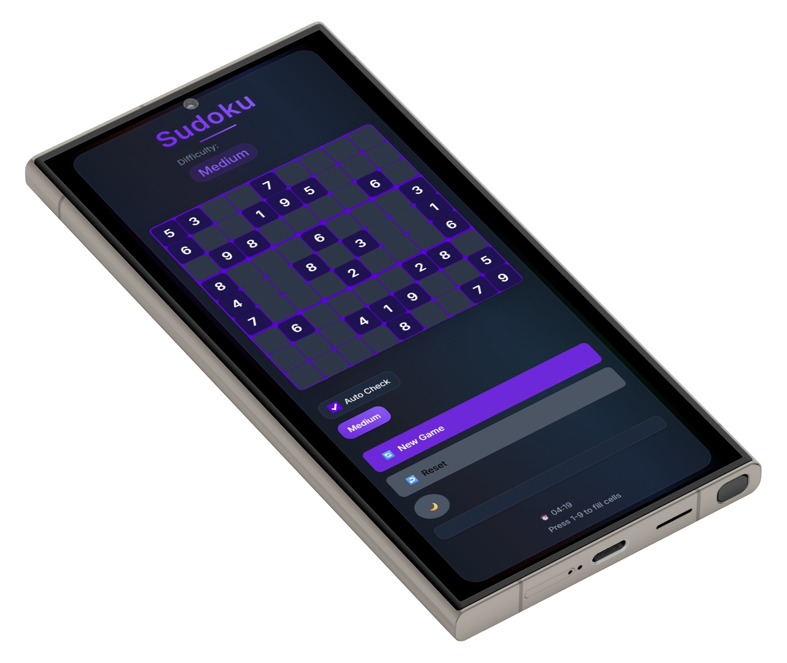

# 🧩 Sudoku Game – KTJ Assignment 2

A web-based Sudoku puzzle game built using **HTML**, **CSS**, and **JavaScript**. This project was developed as part of the KTJ Web Development Assignment 2.

---

## 🌐 Live Demo

You can view and play the game directly in your browser:  
👉 [Live Site](https://vikashgupta16.github.io/KTJ-ASS2/)  
*(Hosted via GitHub Pages)*

---

## 📸 Screenshot

  

---

## 🎮 Features

- ✅ Fully playable 9x9 Sudoku grid
- 🧠 Real-time number entry
- 💡 Clear, minimalist design
- 🧽 Reset button to clear the grid
- 📱 Responsive layout

---

## 🗂️ Folder Structure

KTJ-ASS2/
├── index.html # Main HTML file
├── style.css # Stylesheet
├── script.js # Game logic and interactions
├── assets/ # (Optional) Images like screenshots or icons
└── README.md


---

## 🚀 How to Run Locally

1. **Clone the repository**:
   ```bash
   git clone https://github.com/vikashgupta16/KTJ-ASS2.git
   cd KTJ-ASS2 
2. Open the game:
Open index.html in any modern web browser.
No build tools, servers, or dependencies are needed.

📄 License
This project is licensed under the MIT License.
Feel free to fork and customize for learning or personal use.

🙌 Acknowledgments
Developed as part of the KTJ Summer Camp Assignment

Inspired by classic Sudoku mechanics

✍️ Author
Vikash Gupta
GitHub: @vikashgupta16
